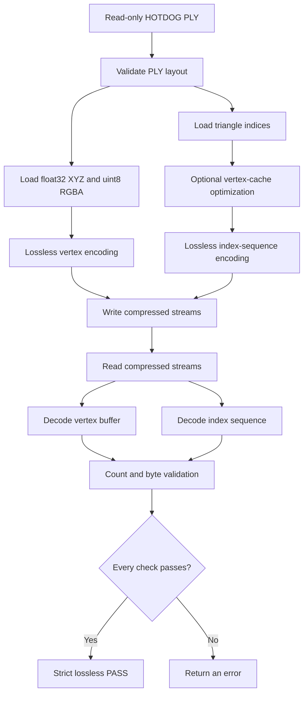

# Lossless HOTDOG Meshoptimizer Sample

This sample demonstrates one complete and verifiable mesh compression round trip:

```text
HOTDOG PLY input → encode → save → read → decode → validate
```

It is intentionally small and heavily commented so the encoding, decoding, and validation steps can be studied independently. It uses meshoptimizer only; Draco is not part of this sample.

## What this sample proves

The sample verifies that:

- the input PLY can be parsed into vertex and triangle-index buffers;
- meshoptimizer can encode both buffers without quantization;
- the encoded streams can be written to disk and read back;
- both streams decode successfully;
- vertex, face, and index counts remain unchanged;
- every decoded vertex byte matches the encoder input;
- every decoded index byte matches the encoder input;
- optional triangle reordering retains the same oriented triangles;
- the original PLY checksum is unchanged after the run.

Counts alone are not considered proof of losslessness. The decisive checks compare every byte in both decoded buffers with the exact prepared buffers supplied to the encoders.

## Requirements

- Linux or another Unix-like operating system
- Bash
- CMake 3.15 or newer
- A C++ compiler supporting C++11
- A CMake build tool such as GNU Make or Ninja
- `sha256sum`

The verified environment used:

```text
GNU C++ 15.2.0
CMake 4.2.3
GNU Make 4.4.1
```

No global meshoptimizer installation is required. CMake builds the library directly from the parent repository.

## Get the sample branch

```bash
git clone git@github.com:nahathaiw/meshoptimizer.git
cd meshoptimizer
git switch sample
```

If the `sample` branch has not been published yet, use the local branch where this directory was created.

## Supported PLY layout

The parser deliberately accepts the tested HOTDOG representation rather than guessing unknown binary layouts:

```text
format binary_little_endian 1.0

vertex properties, in order:
    float x
    float y
    float z
    uchar red
    uchar green
    uchar blue
    uchar alpha

face property:
    property list uchar int vertex_indices
```

Each in-memory vertex is exactly 16 bytes:

```cpp
struct Vertex
{
    float x, y, z;
    uint8_t r, g, b, a;
};
```

Polygon faces are triangulated as a fan. The HOTDOG test file already contains triangle faces.

## Provide the input safely

Do not commit the original HOTDOG file. Pass its path directly:

```bash
./SAMPLE-test/run.sh /absolute/path/to/hotdog.ply
```

Alternatively, place it under `SAMPLE-test/input/`. PLY files in that directory are ignored by Git:

```bash
./SAMPLE-test/run.sh SAMPLE-test/input/hotdog.ply
```

The runner opens the input for reading only. SHA-256 checks before and after the experiment provide an additional input-preservation check.

## Quick start

From the repository root:

```bash
./SAMPLE-test/run.sh /absolute/path/to/hotdog.ply
```

The default mode is `--optimize`, so the command above is equivalent to:

```bash
./SAMPLE-test/run.sh /absolute/path/to/hotdog.ply --optimize
```

To encode the PLY's original triangle order without cache optimization:

```bash
./SAMPLE-test/run.sh /absolute/path/to/hotdog.ply --no-optimize
```

## What the runner does



The runner performs these commands automatically:

```bash
sha256sum INPUT.ply
cmake -S SAMPLE-test -B SAMPLE-test/build -DCMAKE_BUILD_TYPE=Release
cmake --build SAMPLE-test/build --config Release --parallel
SAMPLE-test/build/hotdog_lossless INPUT.ply SAMPLE-test/output SAMPLE-test/results --optimize
sha256sum INPUT.ply
```

## Manual build and execution

To build without the wrapper:

```bash
cmake -S SAMPLE-test -B SAMPLE-test/build -DCMAKE_BUILD_TYPE=Release
cmake --build SAMPLE-test/build --config Release --parallel
```

Create the generated-data directories and run the executable:

```bash
mkdir -p SAMPLE-test/output SAMPLE-test/results

./SAMPLE-test/build/hotdog_lossless \
  /absolute/path/to/hotdog.ply \
  SAMPLE-test/output \
  SAMPLE-test/results \
  --optimize
```

The direct executable validates codec and geometry results. Use `run.sh` when input checksum validation is also required.

## Codec operations

The vertex stream uses:

```cpp
meshopt_encodeVertexBuffer(...);
meshopt_decodeVertexBuffer(...);
```

The index stream uses:

```cpp
meshopt_encodeIndexSequence(...);
meshopt_decodeIndexSequence(...);
```

The index-sequence codec was chosen so the decoded indices can be compared literally with the encoder input. `meshopt_encodeIndexBuffer` is often smaller, but it may cyclically rotate a triangle while preserving its geometry and winding.

## No quantization

The sample does not call a quantizer or lossy attribute filter. Positions remain `float32`, colors remain `uint8`, and all 16 bytes of every vertex are encoded verbatim.

```text
Quantization used: NO
Lossy filters used: NO
```

Optimization and quantization are different:

- vertex-cache optimization changes triangle order without changing triangle membership, winding, positions, or colors;
- quantization reduces numeric precision and would be lossy;
- this sample optionally performs the first operation and never performs the second.

## How validation works

### 1. Decoder status

Both decoder functions must return `0`:

```text
vertex_decode_status=0 PASS
index_decode_status=0 PASS
```

### 2. Count validation

The sample checks the decoded vertex, face, and index counts against the source-derived counts.

### 3. Exact byte validation

The complete decoded buffers are compared with the encoder inputs using the equivalent of:

```cpp
memcmp(original_vertices, decoded_vertices, vertex_byte_count) == 0
memcmp(prepared_indices, decoded_indices, index_byte_count) == 0
```

This detects changes that count checks would miss, including changed coordinates, colors, indices, triangle order, or floating-point bit patterns.

### 4. Optimization validation

When `--optimize` is used, the sample sorts complete oriented index triplets and confirms that the original and prepared index buffers contain the same triangles. The optimizer may move an entire triangle, but it must not change the triangle's indices or winding.

### 5. Input checksum validation

`run.sh` calculates SHA-256 before and after the program. A mismatch stops the script with an error.

## Verified HOTDOG result

The following result was measured using `--optimize`:

| Measurement | Value |
|---|---:|
| Vertices | 501,225 |
| Faces | 1,002,315 |
| Indices | 3,006,945 |
| Raw vertex bytes | 8,019,600 |
| Encoded vertex bytes | 5,729,117 |
| Raw index bytes | 12,027,780 |
| Encoded index bytes | 5,483,934 |
| Combined raw bytes | 20,047,380 |
| Combined encoded bytes | 11,213,051 |
| Encoded/raw | 55.93% |

Expected validation:

```text
vertex_decode_status=0 PASS
index_decode_status=0 PASS
vertex_count_equal=PASS
face_count_equal=PASS
index_count_equal=PASS
vertex_bytes_equal=PASS
index_bytes_equal=PASS
geometry_equal_before_after_optimization=PASS
overall_strict_lossless=PASS
Input checksum validation: PASS
```

The verified original HOTDOG checksum was:

```text
770de889bd896117e1429b4b7e618d98ef2ca3f5d5b6d03da7492e7ab95a6b1f
```

Encoded sizes can change if a different meshoptimizer version, input, or encoding configuration is used. Validation must pass regardless of the compression ratio.

## Generated files

```text
SAMPLE-test/build/
└── hotdog_lossless

SAMPLE-test/output/
├── hotdog.vertex.meshopt
├── hotdog.index.meshopt
├── hotdog.vertex.decoded.bin
└── hotdog.index.decoded.bin

SAMPLE-test/results/
├── console.txt
├── report.txt
├── validation.txt
├── input_checksum_before.txt
└── input_checksum_after.txt
```

All three generated directories are ignored by Git.

## Clean generated files

From the repository root:

```bash
./SAMPLE-test/clean.sh
```

The cleanup script removes only `SAMPLE-test/build`, `SAMPLE-test/output`, and `SAMPLE-test/results`. It does not remove the input or source files.

## Test the repository

The original meshoptimizer tests should also pass:

```bash
make check
```

Check that generated files did not enter version control:

```bash
git status --short
```

The recorded independent-checkout reproduction is available in [`CLEAN-ENVIRONMENT.md`](./CLEAN-ENVIRONMENT.md).

## Troubleshooting

- **Input does not exist:** pass an existing absolute or repository-relative path.
- **Unsupported PLY layout:** confirm the properties and binary format match the supported layout above.
- **CMake is missing:** install CMake 3.15 or newer using the normal package manager for the operating system.
- **Compiler detection fails:** verify that a C++ compiler is installed and available on `PATH`.
- **Decoder returns a nonzero status:** the encoded stream may be truncated, corrupted, or incompatible.
- **Byte comparison fails:** confirm encoding and decoding use matching counts, strides, and codec functions.
- **Checksum changes:** stop using the runner and inspect anything else that may be writing to the input path.
- **Permission denied for `run.sh`:** run `chmod +x SAMPLE-test/run.sh SAMPLE-test/clean.sh` in checkouts that lost executable permissions.

## Lossless conclusion

For this sample, “strict lossless” means:

> The decoded vertex and index buffers are byte-identical to the exact prepared buffers supplied to meshoptimizer, all counts are preserved, optional triangle reordering retains the same oriented triangles, and the original PLY file remains unchanged.

If `--optimize` is enabled, the prepared index order may differ from the order stored in the PLY. That optimization is geometry-preserving. The codec then preserves the prepared order exactly.
